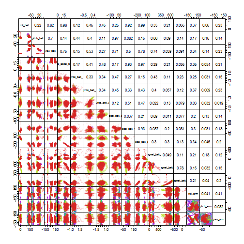

Prediction of Weight Lifting Technique
========================
Practical Machine Learning
---

Jonathan Owen  
October 25th, 2015  

  
Executive Summary
---
Accelerometers on the belts, forearms, arms, and dumbells of 6 study participants performing unilateral bicep curls generated data that could be used to monitor the quality of how the exercise was being performed.  Data from this study were used to train and test an algorithm for predicting whether exercise was being performed correctly or one of four different incorrect ways.  A Random Forest method was used for the prediction.  The best model had an accuracy of 97.5% and an out-of-bag error rate of 1.66%.  When used with a test data set, the model correctly predicted the acvtivity performance class for 19 out of 20 observations.

Data
---
Two data sets are used for machine learning: One for [training](https://d396qusza40orc.cloudfront.net/predmachlearn/pml-training.csv) the algorithm; the other for [testing]([https://d396qusza40orc.cloudfront.net/predmachlearn/pml-testing.csv]) it.  
  
  
**Training data**  
19,622 observations of 159 variables with the following structure:  

+  name of each subject  

+  timestamps and time series

+  *x*-, *y*-, and *z*-axis signals from the accelerometers, gyroscopes, and 
magnetometers positioned on the belt, forearm, arm, and dumbell of each subject

+  pitch, yaw, roll, and acceleration calculated using the signals

+  summary statistics of the measurements and derived quantities for each time series

+  classifier of how the activity was performed (factor with 5 levels, A-E)  

  
**Test data**  
20 observations of the same 159 variables as the training data except that the activity classifier is replaced with a problem identifier.

Exploratory Data Analysis
---
Many of the variables are not suitable for a generalizable prediction of how any individual is performing a bicep curl based a single observation. Any summary statistics and variables associated with the subject or time were removed after downloading and reading the data. 


```r
full_train <- read.csv("pml-training.csv", row.names = 1)
drop_cols <- grep("^min|^max|^avg|^std|^kurt|^skew|^var|^ampli|timest|windo|name", names(full_train))
training <- full_train[,-drop_cols]
```
  
This leaves the activity classifier and 52 possible predictors in the training data. Despite reduction of the number of predictors to approximately 1/3rd of the original number, it is difficult to visually explore the data.  
As an example, Figure 1 shows pairwise correlations between the pitch, yaw, roll, and acceleration observations at each device location.  The data points are colored by activity class. These plots mostly show significant overlap of the data for each activity class.  However, the few regions of single color, such as the purple parts of the arm measurement correlations in the lower right of Figure 1, suggest it might possible to use some form of decision tree prediction.  These methods are also well suited to classification problems. The plots also suggest that with so much overlap it might be useful to further reduce the number of predictors by pre-processing the data.  

Model Training
---  
Based on the type of problem and exploratory data analysis, a Random Forest was selected as an appropriate training method with Principal Component Analysis (PCA) as a pre-processing option. 
The threshold for PCA was 0.95. Decision trees in the Random Forest were based 
on sub-samples of the training data using 25 bootstrap samples and 25 repetitions. After using default values  of the `mtry` parameter for this method, the model was tuned by fixing it at a value of 2.  This specifies the number of randomly-selectd variables to try at each node.


```r
library(caret)
set.seed(201510)
fit_rf <- train(classe~., data = training, method = "rf", preProcess = "pca",
                  tuneGrid= data.frame(mtry = 2))
```

Accuracy and Cross Validation
---
The accuracy of the model is 97.5%

```r
print(fit_rf)
```

```
## Random Forest 
## 
## 19622 samples
##    52 predictor
##     5 classes: 'A', 'B', 'C', 'D', 'E' 
## 
## Pre-processing: principal component signal extraction (52), centered
##  (52), scaled (52) 
## Resampling: Bootstrapped (25 reps) 
## Summary of sample sizes: 19622, 19622, 19622, 19622, 19622, 19622, ... 
## Resampling results
## 
##   Accuracy   Kappa     Accuracy SD  Kappa SD   
##   0.9746344  0.967907  0.002275752  0.002882223
## 
## Tuning parameter 'mtry' was held constant at a value of 2
## 
```

The random sampling included in the Random Forest method means that errors and accuracy can be estimated without the need for separate cross-validation or test sets.  When each tree is constructed from a bootstrap sample, approximately 1/3rd of the observations are left out.  At the end of the run, the predictions for each observation can be tested with the trees from which it was omitted. The 
proportion of incorrect predictions then can be averaged over all observations 
to give the out-of-bag error estimate, which is also an estimate of the out-of-sample error rate.


```r
print(fit_rf$finalModel)
```

```
## 
## Call:
##  randomForest(x = x, y = y, mtry = param$mtry) 
##                Type of random forest: classification
##                      Number of trees: 500
## No. of variables tried at each split: 2
## 
##         OOB estimate of  error rate: 1.66%
## Confusion matrix:
##      A    B    C    D    E class.error
## A 5554    6   13    4    3 0.004659498
## B   50 3714   29    1    3 0.021859363
## C    2   33 3359   26    2 0.018410286
## D    4    1  105 3102    4 0.035447761
## E    0    9   18   13 3567 0.011089548
```
For this Random Forest model, the out-of-bag error estimate is 1.66%.  
  
Test Data
---  
The model was used to predict the activity class of the 20 observations in the 
test data set. Predictions were correct for 19 of the 20 observations.
  
  
Additional Resources
--------------------
Links to data sets.
[https://d396qusza40orc.cloudfront.net/predmachlearn/pml-training.csv]
[https://d396qusza40orc.cloudfront.net/predmachlearn/pml-testing.csv]

The data for this work come from the following study  
Ugulino, W.; Cardador, D.; Vega, K.; Velloso, E.; Milidiu, R.; Fuks, H. 
*Wearable Computing: Accelerometers' Data Classification of Body Postures and Movements*. Proceedings of 21st Brazilian Symposium on Artificial Intelligence. Advances in Artificial Intelligence - SBIA 2012. In: Lecture Notes in Computer Science. , pp. 52-61. Curitiba, PR: Springer Berlin / Heidelberg, 2012. ISBN 978-3-642-34458-9. DOI: 10.1007/978-3-642-34459-6_6. 
http://groupware.les.inf.puc-rio.br/har  
  
Figure 1
---
 


